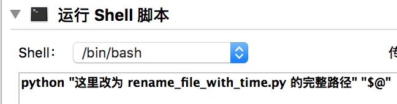

# macOS Automator workflow

### 一键推出所有挂载磁盘.workflow

> 弃用。改用 Alfred 的 Eject

### 重命名文件-按修改时间.workflow

需求场景：照片用修改时间批量重命名

使用方法：

​	1，[下载](https://github.com/NodeWee/Automator-Workflow/archive/master.zip) “重命名文件-按修改时间.workflow” 和 "rename_file_with_time.py” 两个文件

​	2，用 Automator 打开 .workflow 文件，修改填入 .py 文件的完整路径。如下图：

​	3，安装该 workflow（双击运行该 workflow 文件，选择安装）

​	然后在文件或文件夹上右键-服务-重命名文件-按修改时间

